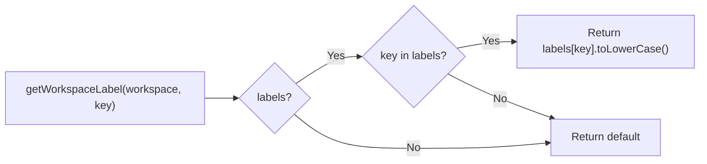
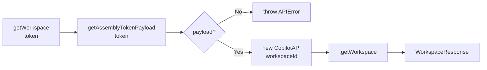

# `workspace.test.ts` — Test Documentation

Tests for `src/utils/workspace.ts`, which provides two exports: a pure label-lookup helper and an async function to fetch workspace data from the Copilot API.

---

## `getWorkspaceLabel`

A synchronous function that resolves a human-readable label from a `WorkspaceResponse` object.

### Lowercasing (4 test cases)

Each of the four label keys is lowercased before being returned:

| Key | Input value | Output |
|---|---|---|
| `individualTerm` | `"Patient"` | `"patient"` |
| `individualTermPlural` | `"Patients"` | `"patients"` |
| `groupTerm` | `"Org"` | `"org"` |
| `groupTermPlural` | `"Orgs"` | `"orgs"` |

### Fallback defaults (4 test cases)

When a label is absent (either `labels` is `undefined` or the specific key is `undefined`), the function falls back to a hardcoded default. Both scenarios exercise the same code path (`??` / `||` chain), so a single parameterized test covers them:

| Key | Default |
|---|---|
| `individualTerm` | `"client"` |
| `individualTermPlural` | `"clients"` |
| `groupTerm` | `"company"` |
| `groupTermPlural` | `"companies"` |

### Idempotency (1 test case)

Input that is already lowercase passes through unchanged — ensures the function doesn't double-lowercase or corrupt the value.

---

## `getWorkspace`

An async function that decodes the request token into its payload, instantiates `CopilotAPI` with the resolved `workspaceId`, and calls `getWorkspace()`.

### `CopilotAPI` and `getAssemblyTokenPayload` are mocked

- `@/lib/copilot/CopilotAPI` is replaced with a `vi.fn()` that returns a stub instance whose `getWorkspace` resolves with a known `WorkspaceResponse` (all four labels: `Patient`/`Patients`/`Org`/`Orgs`).
- `@/lib/copilot/utils` is mocked so `getAssemblyTokenPayload` resolves to `{ workspaceId: 'ws_1' }`. This keeps the real Assembly SDK out of the test — importing it under vitest crashes on an unsupported ESM directory import.

### Tests

1. **Returns the result from `copilot.getWorkspace()`** — asserts the returned object has the expected shape (`id`, `brandName`, `portalUrl`).
2. **Constructs `CopilotAPI` with the decoded `workspaceId`, not the raw token** — verifies the token is passed to `getAssemblyTokenPayload` and the resulting `workspaceId` (`ws_1`) is passed to the `CopilotAPI` constructor.
3. **Throws when the token payload cannot be decoded** — when `getAssemblyTokenPayload` returns `null`, `getWorkspace` rejects with `Unable to decode Copilot token payload`.

Together these confirm `getWorkspace` decodes the token, guards the null case, and delegates construction and data fetching with no extra transformation.
